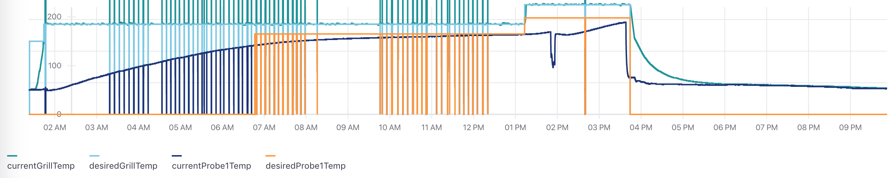

## Dev Setup

- Install node 12
- Setup and run the `gmg-js` project https://github.com/facultymatt/gmg-js
- Install this project deps `npm i`
- Configure `.env`
- start `npm start`
- visit `http://localhost:3001/` and see a graph! If you configured it correctly a line graph should appear. If not, check `.env` and try again.

## Adjusting chart

See src/RecentGrillStatusGraph/RecentGrillStatusGraph.jsx and you can add / remove metrics to the graph. The metric name should match the value in database. 

On line 43 you can set the chart yDomain, which is currently 220 `const yDomain = [0, 220];`. Set `const yDomain = [0, 500];` for example if you are running the grill hot and want to see the grill temp on the chart.

## Adjusting data

See src/contexts/GrillStatusContext.jsx. The most common adjustments will be limit and skip and whether to record live changes. This can also be set in the `.env` file.

## Running on Raspberry Pi

There is a simple script to facilitate dev / testing on raspberry pi. On each startup / reboot the following steps are prefermed. This makes it easy to run the latest by just power cycling the Pi.

1. pull latest source code from current branch (stay on master)
2. run `yarn` to get latest dependencies 
3. run `yarn start` to start in dev mode. (Eventually there will a way to run a built or dist version.)

### How to setup

- `sudo vi /etc/systemd/system/frontend.service` 
- paste in contents from `frontend.service`
- `sudo systemctl daemon-reload`
- test starting with `sudo systemctl start frontend.service`
- test stopping with `sudo systemctl stop frontend.service`
- enable at startup `sudo systemctl enable frontend.service`
- test it out with a reboot `sudo reboot`

